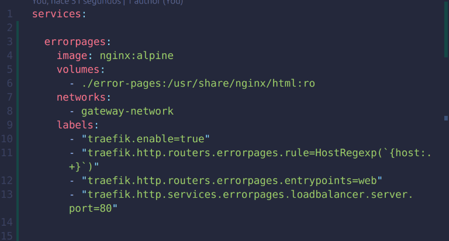

# Autores:
 - Julian Bayona
 - Camilo Ramirez

## 1. Topología y redes
 - docker-compose.yml con los servicios, sin exponer los puertos de neo4j.
 

 - Compilación docker-compose.
 

 - Cargando los registros de los csv a la base de datos.
  

 - Comprobación de funcionamiento api-db.
  

 - Comprobación base de datos no accesible desde el host 
  

## 2. Rutas estructuradas
 - modificación del docker-compose.yml para exponer el dashboard y la api en rutas estructuradas
 
 - api desde la url *http://api.localhost/people*
 
 - Dasboard desde la url *http://ops.localhost/dashboard/dashboard/* 
 

## 3. Middlewares
 - Middlewares del dashboard
 

 - Middlewares de la api
 

 - Comprobación del funcionamiento de los middlewares
 

 - el middleware está configurado para recibir 10 peticiones, por lo cual aparecen las primeras 11 peticiones con codigo 200 de OK, luego cuando se sobrepasan las 11 peticiones aparece el codigo 429 **Too Many Requests** 
 

 - Middleware de autenticación básica
 
  