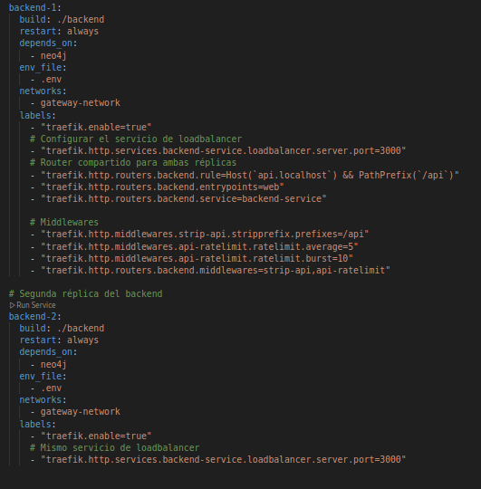
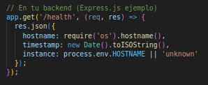
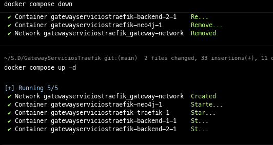
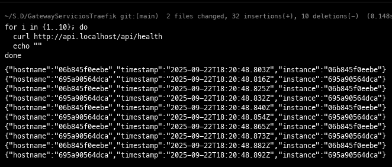
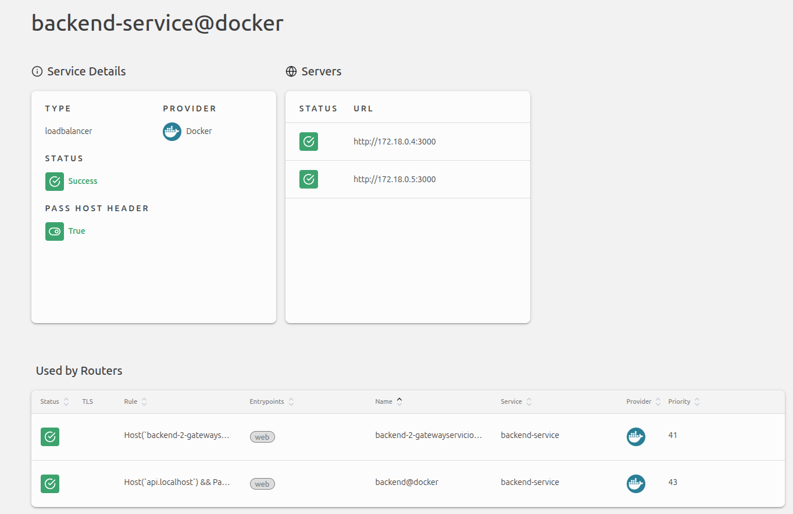

# Autores:
 - Julian Bayona
 - Camilo Ramirez

## 1. Topología y redes
 - docker-compose.yml con los servicios, sin exponer los puertos de neo4j.
 

 - Compilación docker-compose.
 

 - Cargando los registros de los csv a la base de datos.
  

 - Comprobación de funcionamiento api-db.
  

 - Comprobación base de datos no accesible desde el host 
  

## 2. Rutas estructuradas
 - modificación del docker-compose.yml para exponer el dashboard y la api en rutas estructuradas
 
 - api desde la url *http://api.localhost/people*
 
 - Dasboard desde la url *http://ops.localhost/dashboard/dashboard/* 
 

## 3. Middlewares
 

 - Middlewares de la api
 

 - Comprobación del funcionamiento de los middlewares
 
- Middlewares del dashboard
 
 - el middleware está configurado para recibir 10 peticiones, por lo cual aparecen las primeras 11 peticiones con codigo 200 de OK, luego cuando se sobrepasan las 11 peticiones aparece el codigo 429 **Too Many Requests** 
 

 - Middleware de autenticación básica
 
  

## 4. balanceo
- En nuestro Docker-compose.yml lo que hacemos es crear otro servicio haciendo referencia al mismo router
 

-En nueeestra API generamos un endpoint que nos retorne la instacioa de cada servicio

-Bajamos nuestro contenedor y lo levantamos de nuevo

-Hacemos petciones a nuestro endpoint y podemos visualizar como hay en nuestro llamado 2 tipos de peticiones 

-Ya estando es traefik podemos visualizar que el servicio de backend tiene dos servidores.

## 5. Descubrimiento automático

